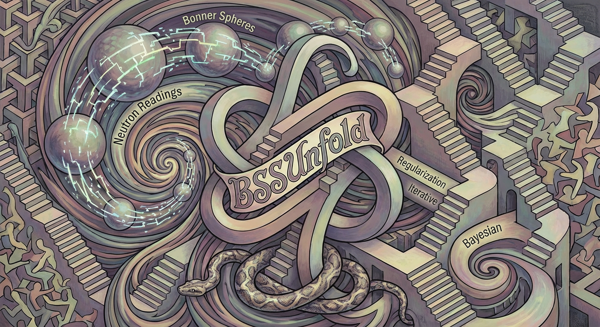

# BSSunfold - Neutron Spectrum Unfolding Package for Bonner Sphere Spectrometers
[](https://pypi.org/project/bssunfold/)
[](https://anaconda.org/conda-forge/bssunfold)
[](https://www.python.org/downloads/)
[](https://www.python.org/downloads/)
[](https://www.gnu.org/licenses/gpl-3.0)
[](https://bssunfold.readthedocs.io/)
[](https://app.codacy.com/gh/Radiationsafety/bssunfold/dashboard?utm_source=gh&utm_medium=referral&utm_content=&utm_campaign=Badge_grade)
[](https://app.codacy.com/gh/Radiationsafety/bssunfold/dashboard?utm_source=gh&utm_medium=referral&utm_content=&utm_campaign=Badge_coverage)
[](https://doi.org/10.5281/zenodo.18056376)
[](https://github.com/Radiationsafety/bssunfold/actions/workflows/cross-platform-tests.yml)
[](https://github.com/Radiationsafety/bssunfold/actions/workflows/cross-platform-tests.yml)
[](https://github.com/Radiationsafety/bssunfold/actions/workflows/cross-platform-tests.yml)


## 🔍 Overview

**BSSUnfold** is a Python package for neutron spectrum unfolding from measurements obtained with Bonner Sphere Spectrometers (BSS). The package implements several mathematical algorithms for solving the inverse problem of unfolding neutron energy spectra from detector readings, with applications in radiation protection, nuclear physics research, and accelerator facilities.



**Contents**
- [Features](#-features)
- [Installation](#-installation)
- [Quick start](#-quick-start)
- [Available Unfolding Methods](#-available-unfolding-methods)
- [Spectrum Comparison](#-spectrum-comparison)
- [Project structure](#-project-structure)
- [Technical requirements](#-technical-requirements)
- [Authors](#-authors)
- [Citing](#-citation)
- [Documentation](#-documentation)
- [Publications](#--publications)


## 📦 Features

- **Multiple Unfolding Algorithms** (21 methods):
  - **Tikhonov-type**: CVXPY, qpsolvers, Legendre basis, TSVD (truncated SVD)
  - **Iterative**: Landweber, MLEM (pure NumPy + ODL), GRAVEL, Doroshenko, Kaczmarz
  - **Bayesian**: D'Agostini iterative (Bayes), Bayes with spline regularization
  - **Maximum Entropy**: MAXED (primal log-space dual minimisation)
  - **Statistical Regularization**: Turchin's method (StatReg)
  - **Optimization-based**: lmfit (L1/L2/Elastic Net), Scipy direct solvers (CG, GMRES, LSQR)
  - **Pipeline**: Combined approach for chaining multiple methods
  - **Parametric**: FRUIT-style thermal/epithermal/fast model (lmfit, cvxpy SQP, qpsolvers SQP, combined)

- **Radiation Dose Calculations**:
  - Effective dose calculations for different irradiation types based on  conversion coefficients from 116 publication of International commission on radiological protection (ICRP)

- **Comprehensive Data Management**:
  - Automatic response function processing
  - Uncertainty quantification via Monte Carlo methods

- **Advanced Visualization**:
  - Spectrum plotting with uncertainty bands
  - Detector reading comparison

## 📥 Installation


### Using uv (recommended)
```bash
uv add bssunfold
```


### Using pip
```bash
pip install bssunfold
```

### Using conda
```bash
conda install conda-forge::bssunfold
```

### From Source
```bash
git clone https://github.com/radiationsafety/bssunfold.git
cd bssunfold
pip install -e .
```

### Optional dependencies

```bash
# Basic installation (without additional solvers)
pip install bssunfold

# With additional cross-platform solvers (recommended)
pip install "bssunfold[solvers-core]"

# All solvers (Unix/Linux/macOS)
pip install "bssunfold[all-solvers]"

# Windows (all except proxsuite)
pip install "bssunfold[windows]"
```

Install with all solvers (Unix/Linux/Mac):
```bash
pip install bssunfold[all-solvers]
```

For Windows is recommended to use the following command because of the problem with proxsuite:
```bash
pip install bssunfold[windows]
```

## 🎯 Quick Start

Open in interactive notebooks:

[](https://colab.research.google.com/github/Radiationsafety/bssunfold/blob/main/examples/01-basic-example.ipynb)
[](https://mybinder.org/v2/gh/Radiationsafety/bssunfold.git/HEAD?urlpath=%2Fdoc%2Ftree%2Fexamples%2F02-basic-example-for-mybinder.ipynb)

```python
import pandas as pd
from bssunfold import Detector

# Load response functions
rf_df = pd.read_csv("../data/response_functions/rf_GSF.csv")

# Initialize detector
detector = Detector(rf_df)

# Provide detector readings [reading per second]
readings = {
    "0in": 0.0003,
    "2in": 0.0099,
    "3in": 0.0536,
    "5in": 0.1841,
    "6in": 0.2196,
    "8in": 0.2200,
    "10in": 0.172,
    "12in": 0.120,
    "15in": 0.066,
    "18in": 0.034,
}

# Unfold spectrum using convex optimization
result = detector.unfold_cvxpy(
    readings,
    regularization=1e-4,
    calculate_errors=True
)

# Visualize results
detector.plot_with_uncertainty(result, plot_style == 'errorbar')

# Calculate and display dose rates
print("Dose rates [pcSv/s]:", result['doserates'])
```

## 📊 Input Data Structure

### Response Functions
Response functions must be provided as a CSV file with the following format:
```
E_MeV,0in,2in,3in,5in,8in,10in,12in
1.00E-09,0.001,0.005,0.01,0.02,0.03,0.04,0.05
1.00E-08,0.002,0.006,0.012,0.022,0.032,0.042,0.052
...
```

### Detector Readings
Readings should be provided as a dictionary mapping sphere names to measured values:
```python
readings = {
    'sphere_0in': 150.2,   # Bare detector
    'sphere_2in': 120.5,   # 2-inch polyethylene sphere
    'sphere_3in': 95.7,    # 3-inch polyethylene sphere
    # ... additional spheres
}
```

## 📦 Built-in Response Functions

The package includes 7 built-in response function datasets for immediate use:

| Dataset | Source | Detectors | Energy Range |
|---------|--------|-----------|--------------|
| `RF_GSF` | GSF (Germany) | 10 (0in–18in) | 1e-9 – 631 MeV |
| `RF_PTB` | PTB (Germany) | 15 (0in–18in) | 1e-9 – 631 MeV |
| `RF_LANL` | LANL (USA) | 11 (3in–18in, + Pb-shielded) | 1e-9 – 631 MeV |
| `RF_JINR` | JINR (Dubna, Russia) | 9 (0in–12in, Cd0in, 10inPb) | 1e-9 – 631 MeV |
| `RF_FERMILAB` | Fermilab (USA) | 8 (0in–18in) | 1e-9 – 631 MeV |
| `RF_EURADOS` | EURADOS round-robin | 13 (0in–12in, Cd2in, 3.5in, 4.5in) | 1e-9 – 20 MeV ⚠️ |
| `RF_IHEP` | IHEP (Protvino, Russia) | 12 (0in–18in, 15in) | 1e-9 – 2000 MeV ⚠️ |

> **⚠️ Note:** `RF_EURADOS` has a narrower energy range (max 20 MeV) and `RF_IHEP` has a wider range (max 2000 MeV) compared to the standard 631 MeV used by GSF/PTB/LANL/JINR/Fermilab. Use caution when comparing results across datasets.

```python
from bssunfold import Detector, RF_JINR

# Use built-in response functions directly
detector = Detector(RF_JINR)
result = detector.unfold_cvxpy(readings, regularization=1e-4)
```

## 🔢 Dose Conversion Coefficients

The package includes 4 dose conversion coefficient datasets for flexible dose rate calculations:

| Dataset | Standard | Quantities | Energy Range |
|---------|----------|------------|--------------|
| `ICRP116` (default) | ICRP-116 | AP, PA, LLAT, RLAT, ISO, ROT | 1e-9 – 631 MeV |
| `ICRP74_effective` | ICRP-74 | AP, PA, RLAT, ROT, ISO | 1e-9 – 398 MeV |
| `NRB99_2009_effective` | NRB99-2009 | AP, ISO | 25 eV – 20 MeV ⚠️ |
| `ICRP74_operational` | ICRP-74 | ADE, PDE0, PDE45, PDE60, PDE75 | 1e-9 – 398 MeV |

> **⚠️ Note:** `NRB99_2009_effective` covers a limited energy range (25 eV – 20 MeV). Values outside this range are set to zero.

```python
from bssunfold import Detector, get_coefficients

# Method 1: Set on Detector (affects all subsequent unfolds)
detector = Detector(cc_type="ICRP74_effective")
result = detector.unfold_cvxpy(readings)

# Method 2: Change after creation
detector.set_dose_coefficients("ICRP74_operational")

# Method 3: Get coefficients directly for custom use
cc = get_coefficients("NRB99_2009_effective")
from bssunfold import interpolate_coefficients
cc_interp = interpolate_coefficients(cc, detector.E_MeV)
```
## ⚙️ Available Unfolding Methods

```mermaid
graph TD
    A[Unfolding Methods] --> B[Tikhonov-type]
    A --> C[Iterative]
    A --> D[Bayesian]
    A --> E[Maximum Entropy]
    A --> F[Statistical Regularization]
    A --> G[Optimization-based]
    A --> H[Pipeline]
    A --> I[Parametric]

    B --> B1[unfold_cvxpy]
    B --> B2[unfold_qpsolvers]
    B --> B3[unfold_tsvd]
    B --> B4[unfold_tikhonov_legendre]

    C --> C1[unfold_landweber]
    C --> C2[unfold_mlem]
    C --> C3[unfold_mlem_odl]
    C --> C4[unfold_gravel]
    C --> C5[unfold_doroshenko]
    C --> C6[unfold_kaczmarz]

    D --> D1[unfold_bayes]
    D --> D2[unfold_bayes_spline_regularization]

    E --> E1[unfold_maxed]
    F --> F1[unfold_statreg]

    G --> G1[unfold_lmfit]
    G --> G2[unfold_scipy_direct_method]

    H --> H1[unfold_combined]

    I --> I1[unfold_parametric]
    I --> I2[unfold_parametric_cvxpy]
    I --> I3[unfold_parametric_qpsolvers]
    I --> I4[unfold_parametric_combined]

    style A fill:#4a90d9,color:#fff
    style B fill:#e8f0fe
    style C fill:#e8f0fe
    style D fill:#e8f0fe
    style E fill:#e8f0fe
    style F fill:#e8f0fe
    style G fill:#e8f0fe
    style H fill:#e8f0fe
    style I fill:#e8f0fe
```



### Method Reference Table

| # | Method | Category | Unique Parameters | Dependencies | Description |
|---|--------|----------|-------------------|--------------|-------------|
| 1 | `unfold_cvxpy` | Tikhonov | `regularization`, `norm` (1/2), `solver`, `regularization_method` | cvxpy | Convex optimization with Tikhonov regularization |
| 2 | `unfold_qpsolvers` | Tikhonov | `regularization`, `norm` (1/2), `solver`, `smoothness_order`, `smoothness_weight`, `regularization_method` | qpsolvers | QP-based unfolding with L1/L2/smoothness norms |
| 3 | `unfold_tsvd` | Tikhonov | `method` (l_curve/gcv/discrepancy/energy/median/donoho), `k`, `threshold`, `noise_level` | — | Truncated SVD with automatic k-selection |
| 4 | `unfold_tikhonov_legendre` | Tikhonov | `delta`, `n_polynomials` | — | Tikhonov regularization in Legendre polynomial basis |
| 5 | `unfold_landweber` | Iterative | `max_iterations`, `tolerance` | — | Landweber fixed-point iteration |
| 6 | `unfold_mlem` | Iterative | `max_iterations`, `tolerance` | — | Pure-NumPy MLEM (expectation maximization) |
| 7 | `unfold_mlem_odl` | Iterative | `max_iterations`, `tolerance` | odl | MLEM via ODL operator framework |
| 8 | `unfold_gravel` | Iterative | `max_iterations`, `tolerance`, `regularization` | — | GRAVEL algorithm with relative entropy weighting |
| 9 | `unfold_doroshenko` | Iterative | `max_iterations`, `tolerance`, `regularization` | — | Coordinate-update iterative method |
| 10 | `unfold_kaczmarz` | Iterative | `max_iterations`, `omega`, `tolerance` | — | ART (Algebraic Reconstruction Technique) |
| 11 | `unfold_bayes` | Bayesian | `max_iterations`, `tolerance` | — | D'Agostini Bayesian iterative unfolding |
| 12 | `unfold_bayes_spline_regularization` | Bayesian | `max_iterations`, `tolerance`, `spline_degree`, `spline_smooth` | — | Bayes iteration with spline smoothing |
| 13 | `unfold_maxed` | MaxEnt | `sigma_factor`, `max_iterations`, `tolerance` | — | Maximum entropy deconvolution (Reginatto & Goldhagen) |
| 14 | `unfold_statreg` | Statistical Reg. | `unfoldermethod` (EmpiricalBayes/...), `regularization`, `basis_name`, `boundary`, `derivative_degree` | — | Turchin's statistical regularization |
| 15 | `unfold_lmfit` | Optimization | `method` (lbfgsb/leastsq/...), `model_name` (elastic/lasso/ridge), `regularization`, `regularization2`, `l1_weight` | lmfit | L1/L2/Elastic Net via lmfit |
| 16 | `unfold_scipy_direct_method` | Optimization | `method` (cg/gmres/lsqr/lsmr/minres), `tolerance`, `max_iterations` | — | Direct SciPy linear solvers |
| 17 | `unfold_combined` | Pipeline | `pipeline` (list of `{method, params}` dicts) | — | Sequential multi-method pipeline |
| 18 | `unfold_parametric` | Parametric | `parametric_method`, `optimizer`, `solver_backend`, `initial_params` | lmfit, cvxpy, qpsolvers | FRUIT-style thermal/epithermal/fast model |
| 19 | `unfold_parametric_cvxpy` | Parametric | `parametric_method`, `initial_params`, `solver_backend` | cvxpy | SQP solver using cvxpy for parametric fitting |
| 20 | `unfold_parametric_qpsolvers` | Parametric | `parametric_method`, `initial_params`, `solver_backend` | qpsolvers | SQP solver using qpsolvers backends |
| 21 | `unfold_parametric_combined` | Parametric | `parametric_method`, `initial_params`, `solver_backend` | lmfit, cvxpy, qpsolvers | lmfit first-pass + QP refinement |

> **Common parameters** (shared by most methods): `readings`, `initial_spectrum`, `calculate_errors`, `noise_level`, `n_montecarlo`, `save_result`, `random_state`.

### Basic Example

```python
import pandas as pd
from bssunfold import Detector

detector = Detector(pd.read_csv("response_functions.csv"))
readings = {"0in": 0.0003, "2in": 0.0099, "3in": 0.0536, "5in": 0.1841}

# Convex optimization
result = detector.unfold_cvxpy(readings, regularization=1e-4, calculate_errors=True)

# Dose rates
print(result["doserates"])

# Plot with uncertainty
detector.plot_with_uncertainty(result)
```

### Pipeline Example

```python
result = detector.unfold_combined(
    readings=readings,
    pipeline=[
        {"method": "cvxpy", "params": {"regularization": 1e-4}},
        {"method": "landweber", "params": {"max_iterations": 2000}},
    ],
    calculate_errors=True,
)
```

### Parametric Example

```python
# FRUIT-style parametric model (thermal + epithermal + fast)
result = detector.unfold_parametric(
    readings=readings,
    parametric_method='thermal+epithermal+fast',
    optimizer='cvxpy',           # or 'lmfit', 'qpsolvers', 'combined'
    solver_backend='cvxpy:ECOS', # or 'qpsolvers:osqp'
    calculate_errors=True,
)

# The parametric model fit yields spectrum components
print(result['doserates'])
```

## 📊 5-Detector Comparison

The dose rate evaluation scripts compare results across 5 detector configurations:

| Detector | Origin | Detectors | Energy Range |
|----------|--------|-----------|--------------|
| GSF | Germany | 10 (0in–18in) | 1e-9 – 631 MeV |
| PTB | Germany | 15 (0in–18in) | 1e-9 – 631 MeV |
| LANL | USA | 11 (3in–18in, + Pb-shielded) | 1e-9 – 631 MeV |
| JINR | Dubna, Russia | 9 (0in–12in, Cd0in, 10inPb) | 1e-9 – 631 MeV |
| FERMILAB | Fermilab, USA | 8 (0in–18in) | 1e-9 – 631 MeV |

ISO scatter plots with per-detector color coding are generated in `tests/iso_plots/` and `tests/iaea_compendium_iso_plots/`.

## 📊 Spectrum Comparison

Compare two or more unfolded spectra using a comprehensive set of 25 metrics.

```python
import numpy as np
from bssunfold import Detector

detector = Detector()

r1 = detector.unfold_qpsolvers(readings, save_result=False)
r2 = detector.unfold_cvxpy(readings, save_result=False)

# Compare two results (all 25 metrics)
result = detector.compare(r1, r2)
print(result['cosine_similarity'], result['mean_squared_error'])

# Compare with specific metrics
detector.compare(r1, r2, metrics=['cosine_similarity', 'kl_divergence'])

# Compare raw spectra
df = detector.compare(
    np.ones(detector.n_energy_bins),
    np.ones(detector.n_energy_bins) * 2,
    np.ones(detector.n_energy_bins) * 3,
    labels=['Ref', 'A', 'B'],
)
print(df)

# Visual comparison
detector.compare(r1, r2, plot=True, save_to='comparison.png')

# Independent usage
from bssunfold.utils.comparison import compare_spectra, kl_divergence
all_metrics = compare_spectra(s1, s2)
print(kl_divergence(s1, s2))
```



```mermaid
graph TD
    A[Comparison Metrics<br/>25 total] --> B[Entropy]
    A --> C[Distribution]
    A --> D[Correlation]
    A --> E[Error]
    A --> F[Similarity]
    A --> G[Chi-squared]
    A --> H[Statistical]

    B --> B1[kl_divergence]
    B --> B2[cross_entropy]
    B --> B3[entropy_difference_percent]

    C --> C1[wasserstein_dist]
    C --> C2[energy_dist]
    C --> C3[kolmogorov_smirnov_stat]

    D --> D1[pearson_r]
    D --> D2[spearman_r]

    E --> E1[mean_squared_error]
    E --> E2[root_mean_squared_error]
    E --> E3[mean_absolute_error]
    E --> E4[mape]
    E --> E5[r2_score]
    E --> E6[max_error]
    E --> E7[median_absolute_error]

    F --> F1[cosine_similarity]
    F --> F2[mmd_rbf]

    G --> G1[chi_squared]
    G --> G2[g_test]
    G --> G3[freeman_tukey]
    G --> G4[cressie_read]

    H --> H1[anderson_darling]
    H --> H2[wilcoxon_test]
    H --> H3[mannwhitneyu_test]
    H --> H4[standardized_mean_difference]

    style A fill:#4a90d9,color:#fff
```

### All 25 Metrics

| Category | Metric Key | Description | Range |
|----------|-----------|-------------|-------|
| **Entropy** | `kl_divergence` | Kullback-Leibler divergence D_KL(p‖q) | [0, ∞) |
| | `cross_entropy` | Cross-entropy H(p,q) = -∑p·log(q) | [0, ∞) |
| | `entropy_difference_percent` | Relative cross-entropy excess (%) | [0, ∞) |
| **Distribution** | `wasserstein_dist` | Earth mover's / Wasserstein distance | [0, ∞) |
| | `energy_dist` | Energy distance between distributions | [0, ∞) |
| | `kolmogorov_smirnov_stat` | Kolmogorov-Smirnov D-statistic | [0, 1] |
| **Correlation** | `pearson_r` | Pearson correlation coefficient | [-1, 1] |
| | `spearman_r` | Spearman rank correlation | [-1, 1] |
| **Error** | `mean_squared_error` | Mean squared error | [0, ∞) |
| | `root_mean_squared_error` | Root mean squared error | [0, ∞) |
| | `mean_absolute_error` | Mean absolute error | [0, ∞) |
| | `mape` | Mean absolute percentage error (%) | [0, 100] |
| | `r2_score` | R² (coefficient of determination) | (-∞, 1] |
| | `max_error` | Maximum residual error | [0, ∞) |
| | `median_absolute_error` | Median absolute error | [0, ∞) |
| **Similarity** | `cosine_similarity` | Cosine similarity cos(θ) = (p·q)/(‖p‖‖q‖) | [0, 1] |
| | `mmd_rbf` | Maximum Mean Discrepancy (RBF kernel) | [0, ∞) |
| **Chi-squared** | `chi_squared` | Pearson's chi-squared statistic | [0, ∞) |
| | `g_test` | G-test (log-likelihood ratio) | [0, ∞) |
| | `freeman_tukey` | Freeman-Tukey statistic | [0, ∞) |
| | `cressie_read` | Cressie-Read power divergence | [0, ∞) |
| **Statistical** | `anderson_darling` | Anderson-Darling k-sample statistic | [0, ∞) |
| | `wilcoxon_test` | Wilcoxon signed-rank test statistic | [0, ∞) |
| | `mannwhitneyu_test` | Mann-Whitney U test statistic | [0, ∞) |
| | `standardized_mean_difference` | Cohen's d (SMD) | (-∞, ∞) |

All metrics are implemented with pure NumPy/SciPy — no extra dependencies required.

## 📈 Output Data

The package provides comprehensive output in standardized formats:

### Spectrum Results
- Energy grid in MeV
- Unfolded neutron spectrum for the grid of energy bins
- Uncertainty estimates (if calculated)

### Dose Calculations
- Effective dose rates for different geometries:
  - AP (Anterior-Posterior)
  - PA (Posterior-Anterior)
  - LLAT (Left Lateral)
  - RLAT (Right Lateral)
  - ROT (Rotational)
  - ISO (Isotropic)

### Quality Metrics
- Residual norm
- Iteration counts

## 📝 Application Areas

### Nuclear Research Facilities
- Neutron spectroscopy at particle accelerators
- Reactor neutron field characterization
- Fusion device diagnostics

### Radiation Protection
- Workplace monitoring at nuclear power plants
- Medical accelerator facilities
- Industrial radiography installations

### Scientific Research
- Space radiation studies
- Cosmic ray neutron measurements
- Nuclear physics experiments

## 🔬 Advanced Features

### Result Management
```python
# List all saved results
results = detector.list_results()
print(f"Available results: {results}")

# Retrieve specific result
result = detector.get_result('20240115_143022_cvxpy')

# Create comprehensive report
report = detector.create_summary_report(
    save_path='unfolding_report.json'
)

# Clear results history
detector.clear_results()
```

### Custom Uncertainty Analysis
```python
# Custom Monte Carlo parameters
result = detector.unfold_cvxpy(
    readings,
    calculate_errors=True,
    n_montecarlo=500,      # Number of samples
    noise_level=0.02       # 2% measurement noise
)

# Access uncertainty data
uncert_mean = result['spectrum_uncert_mean']
```

## 📂 Project Structure

```
bssunfold/
├── CHANGELOG.md
├── CITATION.cff
├── CODE_OF_CONDUCT.md
├── CONTRIBUTING.md
├── LICENSE
├── README.md
├── SECURITY.md
├── TESTS_AND_DOCS.md
├── pyproject.toml
├── uv.lock
├── environment.yml
├── assets/                      # Logos, images
├── conda.recipe/                # Conda build recipe
├── docs/                        # Sphinx documentation
│   ├── index.rst
│   ├── overview.rst             # Methods & metrics overview
│   ├── detector.rst             # Full API reference
│   ├── examples.rst
│   ├── conf.py
│   └── requirements.txt
├── examples/                    # Jupyter notebooks
├── tests/                       # 632 tests across 9 files
└── src/
    └── bssunfold/
        ├── __init__.py          # Public API: Detector
        ├── constants.py         # ICRP-116 dose coefficients
        ├── logging_config.py
        ├── platform_check.py    # Solver availability checks
        ├── core/
        │   ├── __init__.py
        │   ├── _base_unfolder.py
        │   ├── _matrix_utils.py # SVD, derivative matrix
        │   ├── _montecarlo.py    # MC uncertainty
        │   ├── detector.py      # Main Detector class
        │   ├── dose_calculation.py
        │   ├── regularization.py   # L-curve, GCV, DP
        │   ├── unfold_cvxpy.py
        │   ├── unfold_qpsolvers.py
        │   ├── unfold_tsvd.py
        │   ├── unfold_tikhonov_legendre.py
        │   ├── unfold_landweber.py
        │   ├── unfold_mlem.py
        │   ├── unfold_mlem_odl.py
        │   ├── unfold_gravel.py
        │   ├── unfold_doroshenko.py
        │   ├── unfold_kaczmarz.py
        │   ├── unfold_bayes.py
        │   ├── unfold_bayes_spline_regularization.py
        │   ├── unfold_maxed.py
        │   ├── unfold_statreg.py
        │   ├── unfold_lmfit.py
        │   ├── unfold_scipy_direct_method.py
        │   ├── unfold_combined.py
        │   └── unfold_parametric.py
        └── utils/
            ├── __init__.py
            ├── comparison.py    # 25 spectrum metrics
            ├── converters.py
            ├── interpolation.py
            ├── plotting.py
            └── validators.py
```

## 🔧 Technical Requirements

### Core Requirements
- Python 3.11+
- NumPy, SciPy, Pandas, Matplotlib
- cvxpy[ecos] — convex optimisation framework (CVXPY-based methods)

### Optional Backends
- `pytikhonov` — L-curve / GCV / DP regularisation (Tikhonov-type methods)
- `qpsolvers[solvers-core]` — QP solvers (unfold_qpsolvers)
- `lmfit` — L1/L2/Elastic Net regularisation (unfold_lmfit)
- `odl` — Operator Discretization Library (unfold_mlem_odl)

All other methods (GRAVEL, MAXED, Bayes, StatReg, TSVD, ScipyDirect, Landweber, Kaczmarz, Doroshenko, MLEM, TikhonovLegendre) have **no extra dependencies** beyond NumPy/SciPy.

See [pyproject.toml](https://github.com/Radiationsafety/bssunfold/blob/main/pyproject.toml) for version constraints.

## Performance

- **Matrix Operations**: Optimized NumPy operations for response matrices

## 📖 Citation
[](https://scholar.google.com/citations?user=CtXdf28AAAAJ&hl=en)

If you use BSSUnfold in your research, please cite paper:
```bibtex
@article{chizhov2024neutron,
  title={Neutron spectra unfolding from Bonner spectrometer readings by the regularization method using the Legendre polynomials},
  author={Chizhov, K and Beskrovnaya, L and Chizhov, A},
  journal={Physics of Particles and Nuclei},
  volume={55},
  number={3},
  pages={532--534},
  year={2024},
  publisher={Springer}
}
```

or software:
```bibtex
@misc{konstantin_radiationsafetybssunfold_2025,
	title = {Radiationsafety/bssunfold},
	copyright = {GNU General Public License v3.0 only},
	shorttitle = {Radiationsafety/bssunfold},
	url = {https://zenodo.org/doi/10.5281/zenodo.18056376},
	abstract = {first published version of package},
	urldate = {2026-01-12},
	publisher = {Zenodo},
	author = {Chizhov, Konstantin},
	month = dec,
	year = {2025},
	doi = {10.5281/ZENODO.18056376},
}
```

## 💬 Contributing

Contributions are welcome! Please see [CONTRIBUTING.md](CONTRIBUTING.md) for guidelines.

1. Fork the repository
2. Create a feature branch
3. Add tests for new functionality
4. Ensure all tests pass
5. Submit a pull request

## 📘 Documentation

Documentation and API reference is available in /docs folder. Theory and methodology in the research paper, examples of usage in /examples folder. Check the https://bssunfold.readthedocs.io/en/latest/

## 📄 License

This project is licensed under the GNU General Public License v3.0 - see the [LICENSE](LICENSE) file for details.

## 💬 Support

For questions, bug reports, or feature requests:

- Open an issue on [GitHub](https://github.com/radiationsafety/bssunfold/issues)
- Contact: kchizhov@jinr.ru
 
## 💻 Authors

- Konstantin Chizhov
- Alexei Chizhov
- Dmitry Borschev
- Maria Akimochkina

## 🌐 Acknowledgments

- ICRP and IAEA for data
- Contributors and testers
- Joint Institure for Nuclear Research (JINR)
- University "Dubna", School of Big Data Analytics

## 🎓  Publications

1. Чижов К.А., Чижов А.В., Борщев Д.С., Акимочкина М.А. Методы решения обратных задач для обработки результатов измерений на примере восстановления спектра нейтронов, Тридцать третья международная конференция "Математика. Компьютер. Образование, г. Дубна, 26 – 31 января 2026 г., [https://mce.su](https://mce.su/rus/presentations/p507586/)
1. Chizhov, K., Chizhov, A. Optimization of the Neutron Spectrum Unfolding Algorithm Using Shifted Legendre Polynomials Based on Weighted Tikhonov Regularization. Phys. Part. Nuclei 56, 1395–1399 (2025). https://doi.org/10.1134/S106377962570056X
2. Chizhov K., Beskrovnaya L., Chizhov A. Neutron spectrum unfolding method based on shifted Legendre polynomials, its application to the IREN facility // Phys. Part. Nucl. Lett. — 2025. — V. 22, no. 2. — P. 337–340. — DOI: https://doi.org/10.1134/S154747712470239X
3. Chizhov K., Beskrovnaya L., Chizhov A. Neutron spectra unfolding from Bonner spectrometer readings by the regularization method using the Legendre polynomials // Phys. Part. Nucl. — 2024. — V. 55. — P. 532–534. — DOI: https://doi.org/10.1134/S1063779624030298
4. Chizhov K., Chizhov A. Optimization approach to neutron spectra unfolding with Bonner multi-sphere spectrometer // Math. Model. — 2024. — V. 7. — P. 89–90.
5. Чижов А. В., Чижов К. А. Восстановление спектров опорных нейтронных полей на Фазотроне (ОИЯИ) на основе показаний многошарового спектрометра Боннера методом усеченного сингулярного разложения Тезисы Трудов LXI Всероссийской конференции по физике РУДН 19 - 23 мая 2025.
6. Chizhov, K., Chizhov, A., TSVD-based neutron spectra unfolding by Bonner multi-sphere spectrometer readings with iteration procedure, proceedings of the International Conference "Distributed Computing and Grid-technologies in Science and Education".
1. Белый А.А., Стариковская М.Д., Чижов К.А. Разработка веб-приложения для эксперимента по восстановлению спектра нейтронов с применением алгоритмов нейронный сетей. Системный анализ в науке и образовании. 2025;(2):49–57. 
1. Starikovskaya MD, Chizhov KA. Neutron spectrum unfolding based on random forest algorithm and generated training sample. In Российский университет дружбы народов им. П. Лумумбы; 2025 [cited 2025 Dec 25]. p. 389–94. Available from: https://www.elibrary.ru/item.asp?id=83014906
1. Chizhov KA, Bely AA, Starikovskaia MD, Volkov EN. Восстановление энергетического спектра потока нейтронного излучения с помощью алгоритма машинного обучения «случайный лес». Современные информационные технологии и ИТ-образование. 2024 Dec 15 [cited 2025 Apr 9]; 20(4). Available from: http://sitito.cs.msu.ru/index.php/SITITO/article/view/1167

## 📘 References
1. Compendium of neutron spectra and detector responses for radiation protection purposes: supplement to technical reports series no. 318. — Vienna: International Atomic Energy Agency, 2001. — Technical reports series no. 403. — STI/DOC/010/403. — ISBN 92-0-102201-8.
2. Diamond, S. and Boyd, S., 2016. CVXPY: A Python-embedded modeling language for convex optimization. Journal of Machine Learning Research, 17(83), pp.1-5.


---

**BSSUnfold** - Professional neutron spectrum unfolding for radiation science and nuclear applications.