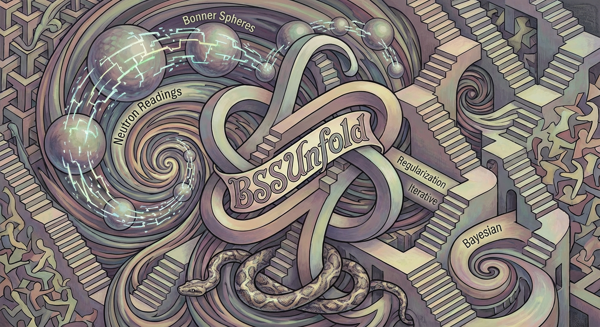

# BSSunfold - Neutron Spectrum Unfolding Package for Bonner Sphere Spectrometers
[](https://pypi.org/project/bssunfold/)
[](https://anaconda.org/conda-forge/bssunfold)
[](https://www.python.org/downloads/)
[](https://www.python.org/downloads/)
[](https://www.gnu.org/licenses/gpl-3.0)
[](https://bssunfold.readthedocs.io/)
[](https://app.codacy.com/gh/Radiationsafety/bssunfold/dashboard?utm_source=gh&utm_medium=referral&utm_content=&utm_campaign=Badge_grade)
[](https://app.codacy.com/gh/Radiationsafety/bssunfold/dashboard?utm_source=gh&utm_medium=referral&utm_content=&utm_campaign=Badge_coverage)
[](https://www.codefactor.io/repository/github/radiationsafety/bssunfold/overview/main)
[](https://doi.org/10.5281/zenodo.18056376)
[](https://github.com/Radiationsafety/bssunfold/actions/workflows/cross-platform-tests.yml)
[](https://github.com/Radiationsafety/bssunfold/actions/workflows/cross-platform-tests.yml)
[](https://github.com/Radiationsafety/bssunfold/actions/workflows/cross-platform-tests.yml)


## 🔍 Overview

**BSSUnfold** is a Python package for neutron spectrum unfolding from measurements obtained with Bonner Sphere Spectrometers (BSS). The package implements several mathematical algorithms for solving the inverse problem of unfolding neutron energy spectra from detector readings, with applications in radiation protection, nuclear physics research, and accelerator facilities. Iterative solvers are accelerated with Numba JIT compilation for 3–50x speedups.



**Contents**
- [Features](#-features)
- [Installation](#-installation)
- [Quick start](#-quick-start)
- [Available Unfolding Methods](#-available-unfolding-methods)
- [Spectrum Comparison](#-spectrum-comparison)
- [Project structure](#-project-structure)
- [Technical requirements](#-technical-requirements)
- [Authors](#-authors)
- [Citing](#-citation)
- [Documentation](#-documentation)
- [Publications](#--publications)


## 📦 Features

- **Multiple Unfolding Algorithms** (55 methods):
  - **Tikhonov-type**: CVXPY, qpsolvers, Legendre basis, TSVD (truncated SVD), EPIC (Equal Posterior Information Condition)
  - **Krylov/hybrid**: Lanczos, GKS (Golub-Kahan bidiagonalization + projected GCV/DP/L-curve), CGLS, FISTA (accelerated proximal gradient), Hybrid GMRES
  - **Iterative**: Landweber, MLEM (pure NumPy + ODL), MLEM-STOP (J-factor stopping), GRAVEL, Doroshenko, Kaczmarz, SART
  - **EM family**: OSEM (ordered subsets), MAP-EM (penalised one-step-late EM), BSREM (block-sequential regularised EM)
  - **Multi-sphere ratio methods**: SAND-II (geometric-mean ratios), BUNKI / BUNKI-UT (SPUNIT and BON31G)
  - **Bayesian**: D'Agostini iterative (Bayes), Bayes with spline regularization, zfit likelihood-based inference
  - **Maximum Entropy**: MAXED (primal log-space dual minimisation)
  - **Statistical Regularization**: Turchin's method (StatReg, Reconst — Fortran STREG1 port)
  - **Optimization-based**: lmfit (L1/L2/Elastic Net), Scipy direct solvers (CG, GMRES, LSQR), Mystic (direct-search: fmin, Powell, diffev), SMT (exact solving via Z3), Genetic (meta-heuristic: PSO, GA, DE, ES, EP, ABC, GWO, CMA-ES via MEALPY), CS (compressive sensing), SCIP (pyscipopt), CPLEX (docplex), QUBO (quantum-inspired annealing)
  - **Evolutionary**: MAEO (Multi-Algorithm Evolutionary Optimization with NSGA-III, C-TAEA, AGE-MOEA-II, SPEA2)
  - **Advanced Proximal**: ODL PDHG, ODL Douglas-Rachford (Total Variation regularization)
  - **Pipeline**: Combined approach for chaining multiple methods
  - **Parametric**: FRUIT-style thermal/epithermal/fast model (lmfit, cvxpy SQP, qpsolvers SQP, combined); BON95 4-component model with directed-divergence iterations

- **Numba JIT-Accelerated Iterative Solvers**:
  - `@njit(cache=True)` compiled inner loops for Doroshenko, Kaczmarz, MLEM, GRAVEL
  - 3–50x speedup on iterative solvers (see [Performance](#-performance))
  - Automatic disk caching of compiled code; graceful fallback when numba is not installed

- **Radiation Dose Calculations**:
  - Effective dose calculations for different irradiation types based on  conversion coefficients from 116 publication of International commission on radiological protection (ICRP)

- **Comprehensive Data Management**:
  - Automatic response function processing
  - Uncertainty quantification via Monte Carlo methods

- **Advanced Visualization**:
  - Spectrum plotting with uncertainty bands
  - Detector reading comparison

## 📥 Installation


### Using uv (recommended)
```bash
uv add bssunfold
```


### Using pip
```bash
pip install bssunfold
```

### Using conda
```bash
conda install conda-forge::bssunfold
```

### From Source
```bash
git clone https://github.com/radiationsafety/bssunfold.git
cd bssunfold
pip install -e .
```

### Optional dependencies

```bash
# Basic installation (without additional solvers)
uv add bssunfold

# all methods
uv add bssunfold[all]

# With numba JIT acceleration (recommended for iterative solvers)
uv add "bssunfold[numba]"

# With additional cross-platform solvers (recommended)
uv add "bssunfold[solvers-core]"

# All solvers (Unix/Linux/macOS)
uv add "bssunfold[all-solvers]"

# Windows (all except proxsuite)
uv add "bssunfold[windows]"

# With QP interpretation via pyoptexplain
uv add "bssunfold[interpret]"

# With Bayesian MCMC unfolding (PyMC + ArviZ)
uv add "bssunfold[mcmc]"
```

Install with all solvers (Unix/Linux/Mac):
```bash
uv add bssunfold[all-solvers]
```

For Windows is recommended to use the following command because of the problem with proxsuite:
```bash
uv add bssunfold[windows]
```

## 🎯 Quick Start

Open in interactive notebooks:

[](https://colab.research.google.com/github/Radiationsafety/bssunfold/blob/main/examples/01-basic-example.ipynb)
[](https://mybinder.org/v2/gh/Radiationsafety/bssunfold.git/HEAD?urlpath=%2Fdoc%2Ftree%2Fexamples%2F02-basic-example-for-mybinder.ipynb)

```python
import pandas as pd
from bssunfold import Detector

# Load response functions
rf_df = pd.read_csv("../data/response_functions/rf_GSF.csv")

# Initialize detector
detector = Detector(rf_df)

# Provide detector readings [reading per second]
readings = {
    "0in": 0.0003,
    "2in": 0.0099,
    "3in": 0.0536,
    "5in": 0.1841,
    "6in": 0.2196,
    "8in": 0.2200,
    "10in": 0.172,
    "12in": 0.120,
    "15in": 0.066,
    "18in": 0.034,
}

# Unfold spectrum using convex optimization
result = detector.unfold_cvxpy(
    readings,
    regularization=1e-4,
    calculate_errors=True
)

# Visualize results
detector.plot_with_uncertainty(result, plot_style == 'errorbar')

# Calculate and display dose rates
print("Dose rates [pcSv/s]:", result['doserates'])
```

## 📊 Input Data Structure

### Response Functions
Response functions must be provided as a CSV file with the following format:
```
E_MeV,0in,2in,3in,5in,8in,10in,12in
1.00E-09,0.001,0.005,0.01,0.02,0.03,0.04,0.05
1.00E-08,0.002,0.006,0.012,0.022,0.032,0.042,0.052
...
```

### Detector Readings
Readings should be provided as a dictionary mapping sphere names to measured values:
```python
readings = {
    'sphere_0in': 150.2,   # Bare detector
    'sphere_2in': 120.5,   # 2-inch polyethylene sphere
    'sphere_3in': 95.7,    # 3-inch polyethylene sphere
    # ... additional spheres
}
```

## 📦 Built-in Response Functions

The package includes 7 built-in response function datasets for immediate use:

| Dataset | Source | Detectors | Energy Range |
|---------|--------|-----------|--------------|
| `RF_GSF` | GSF (Germany) | 10 (0in–18in) | 1e-9 – 631 MeV |
| `RF_PTB` | PTB (Germany) | 15 (0in–18in) | 1e-9 – 631 MeV |
| `RF_LANL` | LANL (USA) | 11 (3in–18in, + Pb-shielded) | 1e-9 – 631 MeV |
| `RF_JINR` | JINR (Dubna, Russia) | 9 (0in–12in, Cd0in, 10inPb) | 1e-9 – 631 MeV |
| `RF_FERMILAB` | Fermilab (USA) | 8 (0in–18in) | 1e-9 – 631 MeV |
| `RF_EURADOS` | EURADOS round-robin | 13 (0in–12in, Cd2in, 3.5in, 4.5in) | 1e-9 – 20 MeV ⚠️ |
| `RF_IHEP` | IHEP (Protvino, Russia) | 12 (0in–18in, 15in) | 1e-9 – 2000 MeV ⚠️ |

> **⚠️ Note:** `RF_EURADOS` has a narrower energy range (max 20 MeV) and `RF_IHEP` has a wider range (max 2000 MeV) compared to the standard 631 MeV used by GSF/PTB/LANL/JINR/Fermilab. Use caution when comparing results across datasets.

```python
from bssunfold import Detector, RF_JINR

# Use built-in response functions directly
detector = Detector(RF_JINR)
result = detector.unfold_cvxpy(readings, regularization=1e-4)
```

## 🔢 Dose Conversion Coefficients

The package includes 4 dose conversion coefficient datasets for flexible dose rate calculations:

| Dataset | Standard | Quantities | Energy Range |
|---------|----------|------------|--------------|
| `ICRP116` (default) | ICRP-116 | AP, PA, LLAT, RLAT, ISO, ROT | 1e-9 – 631 MeV |
| `ICRP74_effective` | ICRP-74 | AP, PA, RLAT, ROT, ISO | 1e-9 – 398 MeV |
| `NRB99_2009_effective` | NRB99-2009 | AP, ISO | 25 eV – 20 MeV ⚠️ |
| `ICRP74_operational` | ICRP-74 | ADE, PDE0, PDE45, PDE60, PDE75 | 1e-9 – 398 MeV |

> **⚠️ Note:** `NRB99_2009_effective` covers a limited energy range (25 eV – 20 MeV). Values outside this range are set to zero.

```python
from bssunfold import Detector, get_coefficients

# Method 1: Set on Detector (affects all subsequent unfolds)
detector = Detector(cc_type="ICRP74_effective")
result = detector.unfold_cvxpy(readings)

# Method 2: Change after creation
detector.set_dose_coefficients("ICRP74_operational")

# Method 3: Get coefficients directly for custom use
cc = get_coefficients("NRB99_2009_effective")
from bssunfold import interpolate_coefficients
cc_interp = interpolate_coefficients(cc, detector.E_MeV)
```
## ⚙️ Available Unfolding Methods


```mermaid
graph TD
    A[Unfolding Methods] --> B[Tikhonov-type]
    A --> J[Krylov/hybrid]
    A --> C[Iterative]
    A --> D[Bayesian]
    A --> E[Maximum Entropy]
    A --> F[Statistical Regularization]
    A --> G[Optimization-based]
    A --> H[Pipeline]
    A --> I[Parametric]

    B --> B1[unfold_cvxpy]
    B --> B2[unfold_qpsolvers]
    B --> B3[unfold_tsvd]
    B --> B4[unfold_tikhonov_legendre]

    J --> J1[unfold_lanczos]
    J --> J2[unfold_gks]
    J --> J3[unfold_cgls]
    J --> J4[unfold_hybrid_gmres]
    J --> J5[unfold_fista]

    C --> C1[unfold_landweber]
    C --> C2[unfold_mlem]
    C --> C3[unfold_mlem_stop]
    C --> C4[unfold_mlem_odl]
    C --> C5[unfold_gravel]
    C --> C6[unfold_doroshenko]
    C --> C7[unfold_kaczmarz]

    D --> D1[unfold_bayes]
    D --> D2[unfold_bayes_spline_regularization]

    E --> E1[unfold_maxed]
    F --> F1[unfold_statreg]
    F --> F2[unfold_reconst]

    G --> G1[unfold_lmfit]
    G --> G2[unfold_scipy_direct_method]
    G --> G3[unfold_mystic]
    G --> G4[unfold_smt]
    G --> G5[unfold_genetic]
    G --> G6[unfold_cs]
    G --> G7[unfold_scip]
    G --> G8[unfold_docplex]
    G --> G9[unfold_epic]

    H --> H1[unfold_combined]

    I --> I1[unfold_parametric]
    I --> I2[unfold_parametric_cvxpy]
    I --> I3[unfold_parametric_qpsolvers]
    I --> I4[unfold_parametric_combined]
    I --> I5[unfold_parametric2]
    I --> I6[unfold_fruit_like]
    I --> I7[unfold_hybrid_parametric]
    I --> I8[unfold_bayesian_parametric]

    style A fill:#4a90d9,color:#fff
    style B fill:#e8f0fe
    style C fill:#e8f0fe
    style D fill:#e8f0fe
    style E fill:#e8f0fe
    style F fill:#e8f0fe
    style G fill:#e8f0fe
    style H fill:#e8f0fe
    style I fill:#e8f0fe
    style J fill:#e8f0fe
```

### Method Reference Table

| # | Method | Category | Unique Parameters | Dependencies | Description |
|---|--------|----------|-------------------|--------------|-------------|
| 1 | `unfold_cvxpy` | Tikhonov | `regularization`, `norm` (1/2), `solver` (CLARABEL, ECOS, ECOS_BB, HIGHS, OSQP, PIQP, PROXQP, QPALM, SCIPY, SCS), `regularization_method` | cvxpy | Convex optimization with Tikhonov regularization |
| 2 | `unfold_qpsolvers` | Tikhonov | `regularization`, `norm` (1/2), `solver` (CLARABEL, ECOS, HIGHS, OSQP, PIQP, PROXQP, QPALM, SCS), `smoothness_order`, `smoothness_weight`, `regularization_method` | qpsolvers | QP-based unfolding with L1/L2/smoothness norms |
| 3 | `unfold_tsvd` | Tikhonov | `method` (l_curve/gcv/discrepancy/energy/median/donoho), `k`, `threshold`, `noise_level` | — | Truncated SVD with automatic k-selection |
| 4 | `unfold_lanczos` | Krylov/hybrid | `regularization_method` (gcv), `max_iterations`, `regularization`, `noise_level` | — | Lanczos-hybrid (Golub-Kahan bidiagonalization) with automatic per-iteration GCV regularization; no a-priori spectrum required |
| 5 | `unfold_tikhonov_legendre` | Tikhonov | `delta`, `n_polynomials` | — | Tikhonov regularization in Legendre polynomial basis |
| 6 | `unfold_landweber` | Iterative | `max_iterations`, `tolerance` | — | Landweber fixed-point iteration |
| 7 | `unfold_mlem` | Iterative | `max_iterations`, `tolerance` | — | Pure-NumPy MLEM (expectation maximization) |
| 8 | `unfold_mlem_stop` | Iterative | `max_iterations`, `cps_crossover`, `j_threshold` | — | MLEM with J-factor early stopping criterion (Montgomery et al. 2020) |
| 9 | `unfold_mlem_odl` | Iterative | `max_iterations`, `tolerance` | odl | MLEM via ODL operator framework |
| 10 | `unfold_gravel` | Iterative | `max_iterations`, `tolerance`, `regularization` | — | GRAVEL algorithm with relative entropy weighting |
| 11 | `unfold_doroshenko` | Iterative | `max_iterations`, `tolerance`, `regularization` | — | Coordinate-update iterative method |
| 12 | `unfold_kaczmarz` | Iterative | `max_iterations`, `omega`, `tolerance` | — | ART (Algebraic Reconstruction Technique) |
| 13 | `unfold_bayes` | Bayesian | `max_iterations`, `tolerance` | — | D'Agostini Bayesian iterative unfolding |
| 14 | `unfold_bayes_spline_regularization` | Bayesian | `max_iterations`, `tolerance`, `spline_degree`, `spline_smooth` | — | Bayes iteration with spline smoothing |
| 15 | `unfold_maxed` | MaxEnt | `sigma_factor`, `max_iterations`, `tolerance` | — | Maximum entropy deconvolution (Reginatto & Goldhagen) |
| 16 | `unfold_statreg` | Statistical Reg. | `unfoldermethod` (EmpiricalBayes/...), `regularization`, `basis_name`, `boundary`, `derivative_degree` | — | Turchin's statistical regularization |
| 17 | `unfold_reconst` | Statistical Reg. | `alpha`, `beta`, `max_iter_alpha`, `max_iter_beta`, `tol_alpha`, `tol_beta` | — | Fortran STREG1 port: auto α/β with discrepancy principle & ω-criterion |
| 18 | `unfold_lmfit` | Optimization | `method` (lbfgsb/leastsq/...), `model_name` (elastic/lasso/ridge), `regularization`, `regularization2`, `l1_weight`, `regularization_method` (manual/aic/aicc/bic), `lambda_range`, `n_lambda` | lmfit | L1/L2/Elastic Net via lmfit, with optional AIC/AICc/BIC-based regularization selection |
| 19 | `unfold_scipy_direct_method` | Optimization | `method` (cg/gmres/lsqr/lsmr/minres), `tolerance`, `max_iterations` | — | Direct SciPy linear solvers |
| 20 | `unfold_combined` | Pipeline | `pipeline` (list of `{method, params}` dicts) | — | Sequential multi-method pipeline |
| 21 | `unfold_parametric` | Parametric | `parametric_method`, `optimizer`, `solver_backend`, `initial_params` | lmfit, cvxpy, qpsolvers | FRUIT-style thermal/epithermal/fast model |
| 22 | `unfold_parametric_cvxpy` | Parametric | `parametric_method`, `initial_params`, `solver_backend` | cvxpy | SQP solver using cvxpy for parametric fitting |
| 23 | `unfold_parametric_qpsolvers` | Parametric | `parametric_method`, `initial_params`, `solver_backend` | qpsolvers | SQP solver using qpsolvers backends |
| 24 | `unfold_parametric_combined` | Parametric | `parametric_method`, `initial_params`, `solver_backend` | lmfit, cvxpy, qpsolvers | lmfit first-pass + QP refinement |
| 25 | `unfold_parametric2` | Parametric | `b_range`, `Tf_range`, `c_range`, `noise_level`, `max_iter`, `tol_chi2`, `optimizer`, `solver_backend` | grid, cvxpy, qpsolvers, combined | BON95 4-component model + directed-divergence iterations |
| 26 | `unfold_fruit_like` | Parametric | `initial_params`, `max_iterations`, `tolerance` | — | FRUIT-like model: Maxwellian thermal + 1/E epithermal + evaporation fast |
| 27 | `unfold_hybrid_parametric` | Parametric | `refinement_method` (landweber/mlem), `max_iterations`, `tolerance` | — | Parametric initial guess refined by Landweber or MLEM |
| 28 | `unfold_bayesian_parametric` | Parametric | `n_samples`, `burn_in`, `proposal_scale`, `prior_mean`, `prior_std` | — | Metropolis-Hastings MCMC for spectral parameter estimation |
| 29 | `unfold_mystic` | Optimization | `regularization`, `norm` (1/2), `solver` (fmin/fmin_powell/diffev/diffev2), `maxiter`, `maxfun`, `smoothness_order`, `smoothness_weight`, `regularization_method` | mystic | Direct-search minimization of the penalized least-squares objective |
| 30 | `unfold_smt` | Optimization | `nonneg`, `timeout_ms`, `objective` (l1/l2) | z3-solver | Exact SMT solving of `A·x = b` (integer/rational) with L2 residual (least squares via KKT) and fluence minimization, L1 fallback |
| 31 | `unfold_genetic` | Optimization | `solver` (pso/ga/de/es/ep/abc/gwo/cmaes/nsga2), `epoch`, `pop_size`, `regularization`, `norm` (1/2), `smoothness_order`, `smoothness_weight`, `entropy_weight`, `n_runs`, `early_stop`, `half_range`, `two_step`, `n_coarse`, `smoother`, `sigma_smooth`, `crossover` (single/arithmetic), `mutation` (random/iterative), `pareto_select` (knee/min_residual/max_entropy) | mealpy | Population-based meta-heuristic unfolding (PSO/GA/DE/ES/EP/ABC/GWO/CMA-ES/NSGA-II), with an optional TGASU-style two-step coarse-to-fine scheme, NSGA-II Pareto selection, arithmetic crossover/iterative mutation and post-processing smoothers |
| 32 | `unfold_cs` | Optimization | `n_atoms`, `sparsity`, `dictionary`, `n_dictionary_iterations`, `sigma_min`, `sigma_decrease_factor`, `mu_0`, `L`, `max_iterations`, `tolerance` | — | Compressive sensing: K-SVD dictionary + OMP sparse coding + SL0 reconstruction |
| 33 | `unfold_scip` | Optimization | `regularization`, `norm` (1/2), `timeout`, `smoothness_order`, `smoothness_weight`, `nonneg`, `regularization_method` | pyscipopt | Tikhonov QP solved by the SCIP Optimization Suite (global NLP/QP optimizer) |
| 34 | `unfold_docplex` | Optimization | `regularization`, `norm` (1/2), `timeout`, `smoothness_order`, `smoothness_weight`, `nonneg`, `regularization_method` | docplex, cplex | Tikhonov QP solved by IBM CPLEX via docplex.mp (CPLEX Community Edition) |
| 35 | `unfold_epic` | Regularization | `target_sigmas`, `sigma_frac`, `regularization_order` (0/1/2), `non_neg`, `noise_var`, `homogeneous_step`, `regularize`, `beta_shift_k`, `beta_distance`, `EPIC_bool`, `V`, `LSQpar` | — | EPIC Tikhonov regularization (Ortega-Culaciati et al. 2021): prior variances chosen so a posteriori variances match target sigmas |
| 36 | `unfold_interpret` | Interpretation | `regularization`, `norm` (1/2), `smoothness_order`, `smoothness_weight`, `enforce_norm`, `norm_value`, `regularization_method`, `interpret_options` | pyoptexplain (optional) | Unfolding QP solved via pyoptexplain plus an interpretation report (robustness, shadow prices, detector sensitivity, regularization sweep, scenarios). Also `Detector.interpret_result` for interpretation-only runs |
| 37 | `unfold_cgls` | Krylov/iterative | `max_iterations`, `tolerance`, `regularization`, `smoothness_order`, `noise_level` | — | CGLS (conjugate gradient for least squares) with optional `\|\|L x\|\|^2` Tikhonov term and discrepancy-principle stopping; nonnegative spectrum via clamping |
| 38 | `unfold_gks` | Krylov/hybrid | `regularization_method` (gcv/dp/lcurve/manual), `max_iterations`, `smoothness_order`, `regularization`, `noise_level` | — | Generalized Krylov Subspace (Golub-Kahan bidiagonalization + projected regularization selection); no a-priori spectrum required |
| 39 | `unfold_tikhonov_tv` | Regularization | `epsilon`, `mu`, `max_iterations`, `type_` (TT/TV/T), `beta` (float or `'adapt'`), `zthr`, `tolerance`, `noise_level` | — | Noise-constrained Tikhonov+TV via ADMM (Gazzola & Gholami); adaptive balancing of the TV and Tikhonov terms |
| 40 | `unfold_sandii` | Multi-sphere ratio | `max_iterations`, `tolerance`, `chi_fac` (0/1), `relative_uncertainty`, `noise_level` | — | SAND-II geometric-mean ratio method (McElroy et al. 1967): chi-square or max-relative-deviation stopping |
| 41 | `unfold_bunki` | Multi-sphere ratio | `smoothing`, `max_iterations`, `tolerance`, `noise_level` | — | BUNKI (SPUNIT) iterative unfolding with three-point smoothing (RSICC PSR-266) |
| 42 | `unfold_bunkiut` | Multi-sphere ratio | `smoothing`, `max_iterations`, `tolerance`, `noise_level` | — | BUNKI-UT (BON31G) modernised unfolding (University of Texas) |
| 43 | `unfold_osem` | EM family | `max_iterations`, `n_subsets`, `tolerance`, `noise_level` | — | Ordered-subset expectation maximisation (Hudson & Larkin 1994); `n_subsets=1` reduces to standard MLEM |
| 44 | `unfold_mapem` | EM family | `prior` (none/quadratic/logcosh/relative_difference), `beta`, `prior_delta`, `gamma`, `max_iterations`, `tolerance`, `noise_level` | — | MAP-EM (OSMAPOSL one-step-late penalised EM) with nearest-neighbour priors over the energy axis |
| 45 | `unfold_bsrem` | EM family | `prior` (none/quadratic/logcosh/relative_difference), `beta`, `prior_delta`, `gamma`, `max_iterations`, `n_subsets`, `tolerance`, `relaxation`, `addition_after_iteration`, `noise_level` | — | Block-sequential regularised EM with relaxation sequence and floor clamping (guaranteed convergence for non-convex priors) |
| 46 | `unfold_sart` | Iterative | `max_iterations`, `tolerance`, `relaxation`, `noise_level` | — | Simultaneous algebraic reconstruction technique: relaxed, residual-normalised additive correction |
| 47 | `unfold_ferdor` | Multi-sphere deconvolution | `max_iterations`, `tolerance`, `smoothing`, `chi_squared_target`, `relative_uncertainty` | — | FERDOR few-channel unfolding: constrained least squares with an automatically adjusted smoothing weight chosen by the discrepancy principle |
| 48 | `unfold_rebunki` | Multi-sphere ratio | `smoothing`, `max_iterations`, `tolerance` | — | ReBUNKI (SPUNIT) few-iteration spectral stripping with three-point smoothing and ~1% convergence tolerance |
| 49 | `unfold_nsduaz` | Multi-sphere ratio | `initial_spectrum`, `catalogue`, `use_catalogue`, `reference_name`, `smoothing`, `max_iterations`, `tolerance` | — | NSDUAZ unfolding: catalogue-selected initial spectrum (nuclear-data reference fluxes) refined by the SPUNIT iteration, with a flat-spectrum mode |
| 50 | `unfold_fista` | Krylov/hybrid | `max_iterations`, `tolerance`, `regularization`, `l1_penalty`, `tv_penalty`, `nonnegativity`, `x_min`, `x_max`, `noise_level`, `eta` | — | FISTA (Fast Iterative Shrinkage-Thresholding Algorithm): accelerated proximal gradient method for L1/L2/TV regularized problems with box constraints; O(1/k²) convergence |
| 51 | `unfold_hybrid_gmres` | Krylov/hybrid | `max_iterations`, `regularization_method`, `regularization`, `noise_level`, `eta`, `reorthogonalization` | — | Hybrid GMRES: combines GMRES iteration with Tikhonov regularization on projected problem; automatic regularization selection via GCV/discrepancy principle |
| 52 | `unfold_mcmc` | Bayesian | `sigma_prior`, `lambda_prior`, `n_samples`, `tune`, `chains`, `target_accept`, `use_hierarchical`, `progressbar` | pymc, arviz | Full Bayesian unfolding with the NUTS (Hamiltonian Monte Carlo) sampler: mean posterior spectrum, 95% HPD credible intervals, per-bin posterior std and R-hat / ESS convergence diagnostics under `mcmc_stats` |

> **Common parameters** (shared by most methods): `readings`, `initial_spectrum`, `calculate_errors`, `noise_level`, `n_montecarlo`, `save_result`, `random_state`.

### Basic Example

```python
import pandas as pd
from bssunfold import Detector

detector = Detector(pd.read_csv("response_functions.csv"))
readings = {"0in": 0.0003, "2in": 0.0099, "3in": 0.0536, "5in": 0.1841}

# Convex optimization
result = detector.unfold_cvxpy(readings, regularization=1e-4, calculate_errors=True)

# Dose rates
print(result["doserates"])

# Plot with uncertainty
detector.plot_with_uncertainty(result)
```

### Pipeline Example

```python
result = detector.unfold_combined(
    readings=readings,
    pipeline=[
        {"method": "cvxpy", "params": {"regularization": 1e-4}},
        {"method": "landweber", "params": {"max_iterations": 2000}},
    ],
    calculate_errors=True,
)
```

### Parametric Example

```python
# FRUIT-style parametric model (thermal + epithermal + fast)
result = detector.unfold_parametric(
    readings=readings,
    parametric_method='thermal+epithermal+fast',
    optimizer='cvxpy',           # or 'lmfit', 'qpsolvers', 'combined'
    solver_backend='cvxpy:ECOS', # or 'qpsolvers:osqp'
    calculate_errors=True,
)

# The parametric model fit yields spectrum components
print(result['doserates'])
```

## 📊 5-Detector Comparison

The dose rate evaluation scripts compare results across 5 detector configurations:

| Detector | Origin | Detectors | Energy Range |
|----------|--------|-----------|--------------|
| GSF | Germany | 10 (0in–18in) | 1e-9 – 631 MeV |
| PTB | Germany | 15 (0in–18in) | 1e-9 – 631 MeV |
| LANL | USA | 11 (3in–18in, + Pb-shielded) | 1e-9 – 631 MeV |
| JINR | Dubna, Russia | 9 (0in–12in, Cd0in, 10inPb) | 1e-9 – 631 MeV |
| FERMILAB | Fermilab, USA | 8 (0in–18in) | 1e-9 – 631 MeV |

ISO scatter plots with per-detector color coding are generated in `tests/iso_plots/` and `tests/iaea_compendium_iso_plots/`.

## 📊 Spectrum Comparison

Compare two or more unfolded spectra using a comprehensive set of 25 metrics.

```python
import numpy as np
from bssunfold import Detector

detector = Detector()

r1 = detector.unfold_qpsolvers(readings, save_result=False)
r2 = detector.unfold_cvxpy(readings, save_result=False)

# Compare two results (all 25 metrics)
result = detector.compare(r1, r2)
print(result['cosine_similarity'], result['mean_squared_error'])

# Compare with specific metrics
detector.compare(r1, r2, metrics=['cosine_similarity', 'kl_divergence'])

# Compare raw spectra
df = detector.compare(
    np.ones(detector.n_energy_bins),
    np.ones(detector.n_energy_bins) * 2,
    np.ones(detector.n_energy_bins) * 3,
    labels=['Ref', 'A', 'B'],
)
print(df)

# Visual comparison
detector.compare(r1, r2, plot=True, save_to='comparison.png')

# Independent usage
from bssunfold.utils.comparison import compare_spectra, kl_divergence
all_metrics = compare_spectra(s1, s2)
print(kl_divergence(s1, s2))
```


```mermaid
graph TD
    A[Comparison Metrics<br/>25 total] --> B[Entropy]
    A --> C[Distribution]
    A --> D[Correlation]
    A --> E[Error]
    A --> F[Similarity]
    A --> G[Chi-squared]
    A --> H[Statistical]

    B --> B1[kl_divergence]
    B --> B2[cross_entropy]
    B --> B3[entropy_difference_percent]

    C --> C1[wasserstein_dist]
    C --> C2[energy_dist]
    C --> C3[kolmogorov_smirnov_stat]

    D --> D1[pearson_r]
    D --> D2[spearman_r]

    E --> E1[mean_squared_error]
    E --> E2[root_mean_squared_error]
    E --> E3[mean_absolute_error]
    E --> E4[mape]
    E --> E5[r2_score]
    E --> E6[max_error]
    E --> E7[median_absolute_error]

    F --> F1[cosine_similarity]
    F --> F2[mmd_rbf]

    G --> G1[chi_squared]
    G --> G2[g_test]
    G --> G3[freeman_tukey]
    G --> G4[cressie_read]

    H --> H1[anderson_darling]
    H --> H2[wilcoxon_test]
    H --> H3[mannwhitneyu_test]
    H --> H4[standardized_mean_difference]

    style A fill:#4a90d9,color:#fff
```

### All 25 Metrics

| Category | Metric Key | Description | Range |
|----------|-----------|-------------|-------|
| **Entropy** | `kl_divergence` | Kullback-Leibler divergence D_KL(p‖q) | [0, ∞) |
| | `cross_entropy` | Cross-entropy H(p,q) = -∑p·log(q) | [0, ∞) |
| | `entropy_difference_percent` | Relative cross-entropy excess (%) | [0, ∞) |
| **Distribution** | `wasserstein_dist` | Earth mover's / Wasserstein distance | [0, ∞) |
| | `energy_dist` | Energy distance between distributions | [0, ∞) |
| | `kolmogorov_smirnov_stat` | Kolmogorov-Smirnov D-statistic | [0, 1] |
| **Correlation** | `pearson_r` | Pearson correlation coefficient | [-1, 1] |
| | `spearman_r` | Spearman rank correlation | [-1, 1] |
| **Error** | `mean_squared_error` | Mean squared error | [0, ∞) |
| | `root_mean_squared_error` | Root mean squared error | [0, ∞) |
| | `mean_absolute_error` | Mean absolute error | [0, ∞) |
| | `mape` | Mean absolute percentage error (%) | [0, 100] |
| | `r2_score` | R² (coefficient of determination) | (-∞, 1] |
| | `max_error` | Maximum residual error | [0, ∞) |
| | `median_absolute_error` | Median absolute error | [0, ∞) |
| **Similarity** | `cosine_similarity` | Cosine similarity cos(θ) = (p·q)/(‖p‖‖q‖) | [0, 1] |
| | `mmd_rbf` | Maximum Mean Discrepancy (RBF kernel) | [0, ∞) |
| **Chi-squared** | `chi_squared` | Pearson's chi-squared statistic | [0, ∞) |
| | `g_test` | G-test (log-likelihood ratio) | [0, ∞) |
| | `freeman_tukey` | Freeman-Tukey statistic | [0, ∞) |
| | `cressie_read` | Cressie-Read power divergence | [0, ∞) |
| **Statistical** | `anderson_darling` | Anderson-Darling k-sample statistic | [0, ∞) |
| | `wilcoxon_test` | Wilcoxon signed-rank test statistic | [0, ∞) |
| | `mannwhitneyu_test` | Mann-Whitney U test statistic | [0, ∞) |
| | `standardized_mean_difference` | Cohen's d (SMD) | (-∞, ∞) |

All metrics are implemented with pure NumPy/SciPy — no extra dependencies required.

## 📈 Output Data

The package provides comprehensive output in standardized formats:

### Spectrum Results
- Energy grid in MeV
- Unfolded neutron spectrum for the grid of energy bins
- Uncertainty estimates (if calculated)

### Dose Calculations
- Effective dose rates for different geometries:
  - AP (Anterior-Posterior)
  - PA (Posterior-Anterior)
  - LLAT (Left Lateral)
  - RLAT (Right Lateral)
  - ROT (Rotational)
  - ISO (Isotropic)

### Quality Metrics
- Residual norm
- Iteration counts

## 📝 Application Areas

### Nuclear Research Facilities
- Neutron spectroscopy at particle accelerators
- Reactor neutron field characterization
- Fusion device diagnostics

### Radiation Protection
- Workplace monitoring at nuclear power plants
- Medical accelerator facilities
- Industrial radiography installations

### Scientific Research
- Space radiation studies
- Cosmic ray neutron measurements
- Nuclear physics experiments

## 🔬 Advanced Features

### Result Management
```python
# List all saved results
results = detector.list_results()
print(f"Available results: {results}")

# Retrieve specific result
result = detector.get_result('20240115_143022_cvxpy')

# Create comprehensive report
report = detector.create_summary_report(
    save_path='unfolding_report.json'
)

# Clear results history
detector.clear_results()
```

### Custom Uncertainty Analysis
```python
# Custom Monte Carlo parameters
result = detector.unfold_cvxpy(
    readings,
    calculate_errors=True,
    n_montecarlo=500,      # Number of samples
    noise_level=0.02       # 2% measurement noise
)

# Access uncertainty data
uncert_mean = result['spectrum_uncert_mean']
```

## 📂 Project Structure

```
bssunfold/
├── CHANGELOG.md
├── CITATION.cff
├── CODE_OF_CONDUCT.md
├── CONTRIBUTING.md
├── LICENSE
├── README.md
├── SECURITY.md
├── TESTS_AND_DOCS.md
├── pyproject.toml
├── uv.lock
├── environment.yml
├── assets/                      # Logos, images
├── conda.recipe/                # Conda build recipe
├── docs/                        # Sphinx documentation
│   ├── index.rst
│   ├── overview.rst             # Methods & metrics overview
│   ├── detector.rst             # Full API reference
│   ├── examples.rst
│   ├── conf.py
│   └── requirements.txt
├── examples/                    # Jupyter notebooks
├── tests/                       # Test suite
│   ├── test_all.py
│   ├── test_comparison.py
│   ├── test_coverage.py         # Edge-case & fallback tests
│   ├── test_coverage_boost.py   # Additional coverage tests
│   ├── test_cs.py               # Compressive sensing tests
│   ├── test_detector.py
│   ├── test_docplex.py          # CPLEX/docplex tests
│   ├── test_dose_coefficients.py
│   ├── test_em_methods.py       # EM family (OSEM/MAP-EM/BSREM) tests
│   ├── test_epic.py             # EPIC regularization tests
│   ├── test_ferdor.py           # FERDOR deconvolution tests
│   ├── test_genetic.py          # Meta-heuristic optimization tests
│   ├── test_genetic_improvements.py
│   ├── test_iaea_validation.py
│   ├── test_improvements.py     # Validators, metrics, MC tests
│   ├── test_interpret.py        # Interpretation report tests
│   ├── test_krylov_tv.py        # Krylov + TV regularization tests
│   ├── test_lanczos.py          # Lanczos-hybrid tests
│   ├── test_methods2.py
│   ├── test_mlem.py
│   ├── test_mlem_stop.py        # MLEM J-factor stopping tests
│   ├── test_mystic.py           # Mystic optimization tests
│   ├── test_new_methods.py
│   ├── test_new_methods_fixed.py
│   ├── test_new_metrics.py
│   ├── test_nsduaz.py           # NSDUAZ catalogue tests
│   ├── test_readings.py
│   ├── test_rebunki.py          # ReBUNKI tests
│   ├── test_reconst.py          # STREG1/Reconst tests
│   ├── test_refactored_fixed.py
│   ├── test_response_functions.py
│   ├── test_scip.py             # SCIP optimization tests
│   ├── test_security.py
│   ├── test_smt.py              # SMT/Z3 exact solving tests
│   ├── test_unfold_parametric.py
│   └── test_unfold_parametric2.py
└── src/
    └── bssunfold/
        ├── __init__.py          # Public API: Detector
        ├── constants.py         # ICRP-116 dose coefficients
        ├── logging_config.py
        ├── platform_check.py    # Solver availability checks
        ├── core/
        │   ├── __init__.py
        │   ├── _base_unfolder.py
        │   ├── _em_priors.py    # EM prior functions (quadratic, logcosh, etc.)
        │   ├── _matrix_utils.py # SVD, derivative matrix
        │   ├── _montecarlo.py   # MC uncertainty (optimized)
        │   ├── _numba_jit.py    # Numba JIT inner loops 
        │   ├── detector.py      # Main Detector class
        │   ├── dose_calculation.py
        │   ├── regularization.py   # L-curve, GCV, DP
        │   ├── unfold_bayes.py
        │   ├── unfold_bayes_spline_regularization.py
        │   ├── unfold_bayesian_parametric.py
        │   ├── unfold_bsrem.py  # Block-sequential regularized EM
        │   ├── unfold_bunki.py  # BUNKI (SPUNIT) multi-sphere ratio
        │   ├── unfold_bunkiut.py # BUNKI-UT (BON31G) modernized
        │   ├── unfold_cgls.py   # Conjugate Gradient Least Squares
        │   ├── unfold_combined.py # Sequential multi-method pipeline
        │   ├── unfold_cs.py     # Compressive sensing (K-SVD + OMP + SL0)
        │   ├── unfold_cvxpy.py  # Convex optimization (Tikhonov)
        │   ├── unfold_docplex.py # IBM CPLEX QP solver
        │   ├── unfold_doroshenko.py # Coordinate-update iterative
        │   ├── unfold_epic.py   # EPIC Tikhonov regularization
        │   ├── unfold_ferdor.py # FERDOR few-channel deconvolution
        │   ├── unfold_fista.py  # Fast Iterative Shrinkage-Thresholding
        │   ├── unfold_fruit_like.py # FRUIT-like parametric model
        │   ├── unfold_genetic.py # Meta-heuristic (PSO/GA/DE/CMA-ES/NSGA-II)
        │   ├── unfold_gks.py    # Generalized Krylov Subspace
        │   ├── unfold_gravel.py # GRAVEL algorithm
        │   ├── unfold_hybrid_gmres.py # Hybrid GMRES with Tikhonov
        │   ├── unfold_hybrid_parametric.py # Parametric + iterative refinement
        │   ├── unfold_interpret.py # Unfolding + interpretation report
        │   ├── unfold_kaczmarz.py # ART (Algebraic Reconstruction)
        │   ├── unfold_lanczos.py # Lanczos-hybrid (Golub-Kahan)
        │   ├── unfold_landweber.py # Landweber fixed-point iteration
        │   ├── unfold_lmfit.py  # L1/L2/Elastic Net via lmfit
        │   ├── unfold_mapem.py  # MAP-EM (OSMAPOSL penalized EM)
        │   ├── unfold_maxed.py  # Maximum entropy deconvolution
        │   ├── unfold_mlem.py   # MLEM (expectation maximization)
        │   ├── unfold_mlem_odl.py # MLEM via ODL operator framework
        │   ├── unfold_mlem_stop.py # MLEM with J-factor stopping
        │   ├── unfold_mystic.py # Direct-search optimization
        │   ├── unfold_nsduaz.py # NSDUAZ catalogue-based unfolding
        │   ├── unfold_osem.py   # Ordered-subset EM
        │   ├── unfold_parametric.py # FRUIT-style parametric fitting
        │   ├── unfold_parametric2.py # BON95 4-component model
        │   ├── unfold_qpsolvers.py # QP-based unfolding
        │   ├── unfold_rebunki.py # ReBUNKI spectral stripping
        │   ├── unfold_reconst.py # STREG1 Fortran port
        │   ├── unfold_sandii.py # SAND-II geometric-mean ratio
        │   ├── unfold_sart.py   # Simultaneous Algebraic Reconstruction
        │   ├── unfold_scip.py   # SCIP Optimization Suite interface
        │   ├── unfold_scipy_direct_method.py # SciPy linear solvers
        │   ├── unfold_smt.py    # SMT exact solving (Z3)
        │   ├── unfold_statreg.py # Turchin's statistical regularization
        │   ├── unfold_tikhonov_legendre.py # Legendre polynomial basis
        │   ├── unfold_tikhonov_tv.py # Tikhonov+TV via ADMM
        │   └── unfold_tsvd.py   # Truncated SVD
        └── utils/
            ├── __init__.py
            ├── comparison.py    # 25 spectrum metrics
            ├── converters.py
            ├── interpolation.py
            ├── plotting.py
            └── validators.py
```

## 🔧 Technical Requirements

### Core Requirements
- Python 3.11+
- NumPy, SciPy, Pandas, Matplotlib
- cvxpy[ecos] — convex optimisation framework (CVXPY-based methods)

### Optional Backends
- `numba` — JIT compilation for iterative solvers (3–50x speedup)
- `pytikhonov` — L-curve / GCV / DP regularisation (Tikhonov-type methods)
- `qpsolvers[solvers-core]` — QP solvers (unfold_qpsolvers)
- `mystic` — constrained/direct-search optimization (unfold_mystic)
- `z3-solver` — SMT exact solving (unfold_smt)
- `pyscipopt` — SCIP Optimization Suite interface (unfold_scip)
- `docplex` + `cplex` — IBM CPLEX modeling & engine (unfold_docplex)
- `mealpy` — population-based meta-heuristic optimization (unfold_genetic)
- `lmfit` — L1/L2/Elastic Net regularisation (unfold_lmfit)
- `odl` — Operator Discretization Library (unfold_mlem_odl)
- `pymc` + `arviz` — Bayesian MCMC/NUTS sampling (unfold_mcmc)

All other methods (GRAVEL, MAXED, Bayes, StatReg, Reconst, TSVD, ScipyDirect, Landweber, Kaczmarz, Doroshenko, MLEM, TikhonovLegendre) have **no extra dependencies** beyond NumPy/SciPy.

See [pyproject.toml](https://github.com/Radiationsafety/bssunfold/blob/main/pyproject.toml) for version constraints.

## Performance

All iterative solvers use Numba JIT-compiled inner loops when numba is installed, with automatic fallback to pure Python.

| Solver | Before | After | Speedup |
|--------|--------|-------|---------|
| **Doroshenko** | 40.6 ms | 0.8 ms | **50x** |
| **Kaczmarz** | 1.4 ms | 0.1 ms | **14x** |
| **MLEM** | 2.7 ms | 0.4 ms | **7x** |
| **GRAVEL** | ~2 ms | 0.6 ms | **3x** |
| cvxpy | 84 ms | 78 ms | ~1x (external solver) |
| qpsolvers | 1.7 ms | 1.6 ms | ~1x (external solver) |

*Benchmarks on 60-bin energy grid, 500 iterations, macOS arm64.*

Install numba for the best performance:
```bash
uv add bssunfold[numba]
```

## 📖 Citation
[](https://scholar.google.com/citations?user=CtXdf28AAAAJ&hl=en)

If you use BSSUnfold in your research, please cite paper:
```bibtex
@article{chizhov2024neutron,
  title={Neutron spectra unfolding from Bonner spectrometer readings by the regularization method using the Legendre polynomials},
  author={Chizhov, K and Beskrovnaya, L and Chizhov, A},
  journal={Physics of Particles and Nuclei},
  volume={55},
  number={3},
  pages={532--534},
  year={2024},
  publisher={Springer}
}
```

or software:
```bibtex
@misc{konstantin_radiationsafetybssunfold_2025,
	title = {Radiationsafety/bssunfold},
	copyright = {GNU General Public License v3.0 only},
	shorttitle = {Radiationsafety/bssunfold},
	url = {https://zenodo.org/doi/10.5281/zenodo.18056376},
	abstract = {first published version of package},
	urldate = {2026-01-12},
	publisher = {Zenodo},
	author = {Chizhov, Konstantin},
	month = dec,
	year = {2025},
	doi = {10.5281/ZENODO.18056376},
}
```

## 💬 Contributing

Contributions are welcome! Please see [CONTRIBUTING.md](CONTRIBUTING.md) for guidelines.

1. Fork the repository
2. Create a feature branch
3. Add tests for new functionality
4. Ensure all tests pass
5. Submit a pull request

## 📘 Documentation

Documentation and API reference is available in /docs folder. Theory and methodology in the research paper, examples of usage in /examples folder. Check the https://bssunfold.readthedocs.io/en/latest/

## 📄 License

This project is licensed under the GNU General Public License v3.0 - see the [LICENSE](LICENSE) file for details.

## 💬 Support

For questions, bug reports, or feature requests:

- Open an issue on [GitHub](https://github.com/radiationsafety/bssunfold/issues)
- Contact: kchizhov@jinr.ru
 
## 💻 Authors

- Konstantin Chizhov
- Alexei Chizhov
- Dmitry Borschev
- Maria Akimochkina

## 🌐 Acknowledgments

- ICRP and IAEA for data
- Contributors and testers
- Joint Institure for Nuclear Research (JINR)
- University "Dubna", School of Big Data Analytics

## 🎓  Publications
1. Chizhov A. V., Chizhov K. A. TSVD-Based Iterative Algorithm of Landweber for Neutron Spectra Unfolding by Bonner Multi-Sphere Spectrometer Readings // Phys. Part. Nuclei. 2026. Т. 57. № 4. С. 750–752. https://doi.org/10.1134/S1063779626700735
1. Чижов К.А., Чижов А.В., Борщев Д.С., Акимочкина М.А. Методы решения обратных задач для обработки результатов измерений на примере восстановления спектра нейтронов, Тридцать третья международная конференция "Математика. Компьютер. Образование, г. Дубна, 26 – 31 января 2026 г., [https://mce.su](https://mce.su/rus/presentations/p507586/)
1. Chizhov, K., Chizhov, A. Optimization of the Neutron Spectrum Unfolding Algorithm Using Shifted Legendre Polynomials Based on Weighted Tikhonov Regularization. Phys. Part. Nuclei 56, 1395–1399 (2025). https://doi.org/10.1134/S106377962570056X
2. Chizhov K., Beskrovnaya L., Chizhov A. Neutron spectrum unfolding method based on shifted Legendre polynomials, its application to the IREN facility // Phys. Part. Nucl. Lett. — 2025. — V. 22, no. 2. — P. 337–340. — DOI: https://doi.org/10.1134/S154747712470239X
3. Chizhov K., Beskrovnaya L., Chizhov A. Neutron spectra unfolding from Bonner spectrometer readings by the regularization method using the Legendre polynomials // Phys. Part. Nucl. — 2024. — V. 55. — P. 532–534. — DOI: https://doi.org/10.1134/S1063779624030298
4. Chizhov K., Chizhov A. Optimization approach to neutron spectra unfolding with Bonner multi-sphere spectrometer // Math. Model. — 2024. — V. 7. — P. 89–90.
5. Чижов А. В., Чижов К. А. Восстановление спектров опорных нейтронных полей на Фазотроне (ОИЯИ) на основе показаний многошарового спектрометра Боннера методом усеченного сингулярного разложения Тезисы Трудов LXI Всероссийской конференции по физике РУДН 19 - 23 мая 2025.
6. Chizhov, K., Chizhov, A., TSVD-based neutron spectra unfolding by Bonner multi-sphere spectrometer readings with iteration procedure, proceedings of the International Conference "Distributed Computing and Grid-technologies in Science and Education".
1. Белый А.А., Стариковская М.Д., Чижов К.А. Разработка веб-приложения для эксперимента по восстановлению спектра нейтронов с применением алгоритмов нейронный сетей. Системный анализ в науке и образовании. 2025;(2):49–57. 
1. Starikovskaya MD, Chizhov KA. Neutron spectrum unfolding based on random forest algorithm and generated training sample. In Российский университет дружбы народов им. П. Лумумбы; 2025 [cited 2025 Dec 25]. p. 389–94. Available from: https://www.elibrary.ru/item.asp?id=83014906
1. Chizhov KA, Bely AA, Starikovskaia MD, Volkov EN. Восстановление энергетического спектра потока нейтронного излучения с помощью алгоритма машинного обучения «случайный лес». Современные информационные технологии и ИТ-образование. 2024 Dec 15 [cited 2025 Apr 9]; 20(4). Available from: http://sitito.cs.msu.ru/index.php/SITITO/article/view/1167

## 📘 References
1. Compendium of neutron spectra and detector responses for radiation protection purposes: supplement to technical reports series no. 318. — Vienna: International Atomic Energy Agency, 2001. — Technical reports series no. 403. — STI/DOC/010/403. — ISBN 92-0-102201-8.
2. Diamond, S. and Boyd, S., 2016. CVXPY: A Python-embedded modeling language for convex optimization. Journal of Machine Learning Research, 17(83), pp.1-5.


---

**BSSUnfold** - Professional neutron spectrum unfolding for radiation science and nuclear applications.