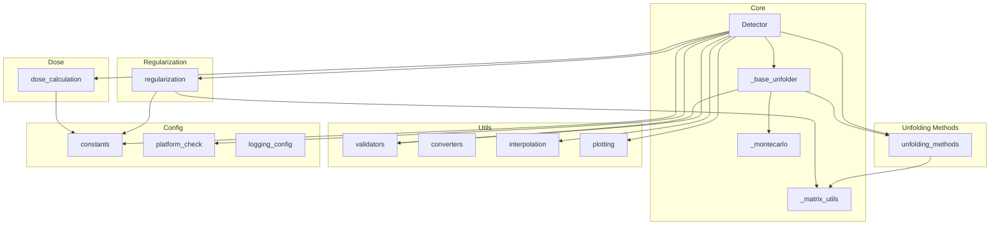

# План рефакторинга bssunfold

## 1. Ключевые проблемы, обнаруженные в коде

### 1.1 Дублирование кода (DRY)

#### Monte-Carlo оценка неопределённости — 7 копий
Методы `unfold_cvxpy`, `unfold_landweber`, `unfold_mlem`, `unfold_qpsolvers`, `unfold_doroshenko`, `unfold_kaczmarz`, `unfold_lmfit`, `unfold_mlem_odl` — каждый содержит **идентичный цикл Monte-Carlo** с минимальными отличиями (разные наборы полей в `output.update`). Это ~40 строк кода × 8 = ~320 строк дублирования.

#### Инициализация `initial_spectrum` — 7 копий
Каждый метод содержит один и тот же паттерн:
```python
if initial_spectrum is None:
    x0 = ...  # разное значение по умолчанию
else:
    x0 = self._normalize_initial_spectrum(initial_spectrum)
    if x0 is None:
        x0 = ...  # то же значение по умолчанию
```

#### Построение системы A, b — 7 копий
```python
readings = self._validate_readings(readings)
A, b, selected = self._build_system(readings)
```

#### Сохранение результата — 7 копий
```python
if save_result:
    self._save_result(output)
```

### 1.2 Проблемы производительности

#### `_convert_rf_to_matrix_variable_step` — медленный цикл Python
```python
for i in range(1, n_points - 1):
    left_step = log_energies[i] - log_energies[i - 1]
    right_step = log_energies[i + 1] - log_energies[i]
    log_steps[i] = (left_step + right_step) / 2
```
Может быть заменён на векторизованную numpy-операцию.

#### `solve_doroshenko` — вложенный цикл Python
```python
for i in range(max_iterations):
    for j in range(x.size):
        ax_without_j = A[:, :j] @ x[:j] + A[:, j + 1:] @ x[j + 1:]
```
Каждая итерация внутреннего цикла создаёт новые срезы массивов и выполняет матричное умножение. Это крайне неэффективно. Можно переписать через предвычисление `A @ x` и обновление по одному элементу.

#### `solve_qpsolvers` — L1-регуляризация через расширение переменных
Создаёт матрицы `P_ext` размером `2n × 2n` и `G_ext` размером `3n × 2n`. Для больших n это может быть проблематично. Можно рассмотреть альтернативную формулировку.

#### `_gcv_fallback` — SVD на каждое alpha
```python
U, s, Vt = np.linalg.svd(A, full_matrices=False)
```
SVD вычисляется внутри цикла по alpha, хотя достаточно одного раза.

#### `cosine_similarity_selection` — цикл с `np.linalg.solve`
100 решений СЛАУ внутри цикла. Можно векторизовать или предвычислить SVD.

### 1.3 Проблемы структуры

#### `Detector` — класс-бог (God class)
Класс `Detector` (1589 строк) содержит:
- 7 методов `unfold_*` с дублированием
- 3 метода для работы с историей результатов
- 2 метода построения графиков
- 2 метода сравнения регуляризации
- Вспомогательные методы

Нарушение **Single Responsibility Principle**.

#### Алиасы импортов
```python
from ..utils.validators import validate_readings as validate_readings_util
from ..utils.interpolation import discretize_spectra as discretize_spectra_util
from ..utils.plotting import plot_with_uncertainty as plot_uncert_util
```
Алиасы не несут смысловой нагрузки и усложняют чтение.

#### `_create_identity_matrix` — избыточная функция
```python
def _create_identity_matrix(n: int) -> np.ndarray:
    return np.eye(n)
```
Просто обёртка над `np.eye`. Используется в `regularization.py` и `unfolding_methods.py` — дублирование.

#### `_create_derivative_matrix` — дублирование в `unfolding_methods.py`
Функция создания матриц производных. Если понадобится в другом месте, придётся дублировать.

### 1.4 Прочие проблемы

#### `_add_noise` — невоспроизводимость
```python
noise = np.random.normal(loc=0, scale=noise_level)
```
Нет `random_state`/`seed`. Monte-Carlo результаты невоспроизводимы.

#### `solve_qpsolvers` — `P = P_base.copy()` при L2
Копирование матрицы `P_base` перед добавлением регуляризации. Можно избежать копирования.

#### `solve_lmfit` — residual-функции пересоздаются при каждом вызове
Три функции (`residual_lasso`, `residual_ridge`, `residual_elastic`) определяются внутри `solve_lmfit`. Их можно вынести на уровень модуля.

#### Магические числа
- `Emin=1e-9` в `_convert_rf_to_matrix_variable_step`
- `dlnE=0.2` в `calculate_dose_rates`
- `alpha_range=(1e-9, 1e2)` в нескольких местах

---

## 2. План рефакторинга

### Этап 1: Выделение общей логики Monte-Carlo

**Файл:** `src/bssunfold/core/_montecarlo.py` (новый)

**Задача:** Создать единую функцию `monte_carlo_uncertainty`, которая принимает:
- `func` — callable для метода unfolding
- `readings` — исходные показания
- `noise_level`, `n_montecarlo` — параметры шума
- `random_state` — для воспроизводимости
- `**kwargs` — параметры для `func`

Возвращает словарь с `spectrum_uncert_mean`, `_std`, `_min`, `_max`, `_median`, `_percentile_5`, `_percentile_95`, `_all`.

**Изменения:** Удалить циклы Monte-Carlo из всех 7 методов `unfold_*` в `detector.py`.

### Этап 2: Выделение общей логики unfold-методов

**Файл:** `src/bssunfold/core/_base_unfolder.py` (новый)

**Задача:** Создать декоратор или базовую функцию `_run_unfolding`, которая инкапсулирует:
1. Валидацию readings
2. Построение A, b
3. Инициализацию `initial_spectrum`
4. Вызов метода unfolding
5. Стандартизацию выхода
6. Monte-Carlo (через `_montecarlo`)
7. Сохранение результата

**Изменения:** Каждый `unfold_*` метод сокращается до ~10 строк.

### Этап 3: Оптимизация производительности

#### 3.1 Векторизация `_convert_rf_to_matrix_variable_step`
```python
# Было: цикл for
log_steps[1:-1] = (log_energies[2:] - log_energies[:-2]) / 2
```

#### 3.2 Оптимизация `solve_doroshenko`
- Предвычислять `Ax = A @ x` один раз на внешнюю итерацию
- Обновлять `Ax` инкрементально при изменении `x[j]`

#### 3.3 SVD вне цикла в `_gcv_fallback`
```python
U, s, Vt = np.linalg.svd(A, full_matrices=False)
# внутри цикла — только O(n) операций
```

#### 3.4 SVD вне цикла в `cosine_similarity_selection`
Аналогично 3.3.

### Этап 4: Улучшение структуры

#### 4.1 Разделение `Detector` на модули
- `detector.py` — только класс `Detector` с базовой инициализацией и свойствами
- `detector_unfolding.py` — методы `unfold_*` (или оставить в `detector.py`, но вынести общую логику)
- `detector_plotting.py` — методы `plot_*`

#### 4.2 Удаление избыточных алиасов импортов
```python
# Было:
from ..utils.validators import validate_readings as validate_readings_util
# Стало:
from ..utils.validators import validate_readings
```

#### 4.3 Удаление `_create_identity_matrix`
Заменить `_create_identity_matrix(n)` на `np.eye(n)`.

#### 4.4 Вынос `_create_derivative_matrix` в отдельный модуль
Создать `src/bssunfold/core/_matrix_utils.py` для общих матричных операций.

### Этап 5: Улучшение тестируемости и воспроизводимости

#### 5.1 `_add_noise` с `random_state`
```python
def _add_noise(self, readings, noise_level=0.01, random_state=None):
    rng = np.random.default_rng(random_state)
    ...
```

#### 5.2 Вынос residual-функций из `solve_lmfit`
На уровень модуля для возможности тестирования.

### Этап 6: Консолидация констант

**Файл:** `src/bssunfold/constants.py`

Добавить:
```python
# Параметры по умолчанию
DEFAULT_ALPHA_RANGE = (1e-9, 1e2)
DEFAULT_N_ALPHAS = 50
DEFAULT_EMIN = 1e-9
DEFAULT_DLNE = 0.2
DEFAULT_NOISE_LEVEL = 0.01
DEFAULT_MONTECARLO_SAMPLES = 100
```

---

## 3. Диаграмма зависимостей после рефакторинга



---

## 4. Оценка объёма изменений

| Файл | Действие | Строк +/- |
|------|----------|-----------|
| `core/_montecarlo.py` | Создать | +80 |
| `core/_base_unfolder.py` | Создать | +100 |
| `core/_matrix_utils.py` | Создать | +40 |
| `core/detector.py` | Рефакторинг | -400 |
| `core/unfolding_methods.py` | Оптимизация | -30 |
| `core/regularization.py` | Оптимизация | -20 |
| `constants.py` | Добавить константы | +10 |
| `utils/validators.py` | Без изменений | 0 |
| `utils/interpolation.py` | Без изменений | 0 |
| `utils/converters.py` | Без изменений | 0 |
| `utils/plotting.py` | Без изменений | 0 |
| `core/dose_calculation.py` | Использовать константы | -2 |
| **Итого** | | **~ -220 строк** |

---

## 5. Порядок выполнения

1. **Создать** `_matrix_utils.py` — вынести `_create_derivative_matrix` и удалить `_create_identity_matrix`
2. **Создать** `_montecarlo.py` — единая функция Monte-Carlo
3. **Создать** `_base_unfolder.py` — обёртка для unfold-методов
4. **Оптимизировать** `_convert_rf_to_matrix_variable_step` (векторизация)
5. **Оптимизировать** `solve_doroshenko` (инкрементальное обновление)
6. **Оптимизировать** `_gcv_fallback` и `cosine_similarity_selection` (SVD вне цикла)
7. **Рефакторинг** `detector.py` — использовать `_base_unfolder` и `_montecarlo`
8. **Добавить** `random_state` в `_add_noise`
9. **Вынести** residual-функции из `solve_lmfit`
10. **Консолидировать** константы
11. **Обновить** тесты